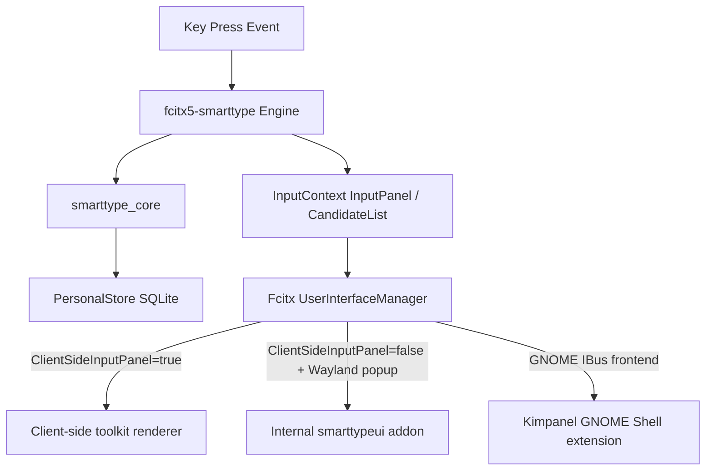

# SmartType Architecture Contract

## Overview
SmartType is a client-server keyboard autocorrecion framework for Linux based on Fcitx5.

## Layers & Components

### 1. `smarttype_core`
- A pure synchronous C++ library.
- Interface: `word + context -> decision`.
- Responsible for token validation, candidate generation, candidate ranking, and safety thresholds.
- Decoupled from Fcitx5 and UI dependencies to enable fast offline evaluation.

### 2. `PersonalStore`
- Local SQLite database located at `$XDG_DATA_HOME/smarttype/personal.sqlite3`.
- Stores user-defined dictionary words, user corrections (learned error-to-correction mapping pairs), revert counts, and context frequencies.
- Raw text from normal typing or passwords is never stored.

### 3. `fcitx5-smarttype` (Addon/Engine)
- Integrates with the Fcitx5 input method daemon.
- Manages the active input context, preedit buffer, commits, and candidate lists.
- Captures key events and dispatches them to `smarttype_core` without blocking the main event loop.

### 4. `smarttypeui` (Internal Fcitx UI Addon)
- Renders the candidate panel in native Wayland and native X11 environments.
- Implemented as a custom server-side input window addon (`smarttypeui.so`) based on ClassicUI.

Composition transport is independent from candidate rendering. On supported
X11 GTK/Qt applications, the toolkit Fcitx module carries client preedit into
the application widget while `smarttypeui` renders only the candidate list in
its XCB window. Raw XIM is a compatibility fallback and must not be used as the
release acceptance path.

---

## Render Path Selection

Candidate rendering is dispatched via Fcitx's `UserInterfaceManager` based on context capabilities:
- **Client-Side Toolkit Rendering**: Triggered when `ClientSideInputPanel=true`. The candidate list is exported via a frontend-specific client-side UI mechanism (e.g., D-Bus for Qt), and the client toolkit's native IM-module manages UI rendering. The internal `smarttypeui` addon does not manage visual rendering on this path, but the engine supplies candidates, selection index, preedit text and formatting metadata; the frontend or toolkit decides which formatting it can render.
- **Internal `smarttypeui` Rendering — Wayland**: Triggered when `ClientSideInputPanel=false` and `frontend=wayland/wayland_v2` (with native popup support). It creates a native Wayland input panel or popup surface.
- **Internal `smarttypeui` Rendering — native X11**: When built with `SMARTTYPE_ENABLE_X11=ON`, the same addon contains `XCBUI`/`XCBInputWindow` and renders an override-redirect candidate window on the active X11 display. This path was restored on 2026-07-13 after the top-level build was found to force `ENABLE_X11=OFF` even though the renderer sources existed.
- **GNOME Wayland — Fcitx IBus frontend + Kimpanel**: GNOME owns the Wayland input-method protocol and does not expose KDE's input-panel protocol. SmartType therefore enables Fcitx's `ibusfrontend` and `kimpanel` addons, disables `smarttypeui`, and lets the Kimpanel GNOME Shell extension render only the candidates. Application composition still travels through the Fcitx GTK/Qt frontend into the focused widget; the popup is never used as a text editor. GNOME retains one compositor XKB source, so the engine normalizes physical keysyms to the active `smarttype-us`/`smarttype` method instead of running the KDE layout bridge.
- **Unsupported/Fallback Configurations**: XWayland input contexts inside a Wayland session still have uncertain cross-coordinate positioning and are not a supported release path. A client-side toolkit renderer may still be used when the input context advertises `ClientSideInputPanel`.
- **Legacy/Experimental**: The external `smarttype-ui` QML process is legacy/experimental and not considered a current supported path.

---

## Input Pipeline & Delimiter Flow

1. **Typing**: Characters are accumulated in the engine's logical word buffer.
   Stable toolkit clients receive that buffer as client preedit. Chromium-family
   clients receive each literal character as an immediate commit while the same
   logical buffer is retained internally; this prevents controlled web inputs
   from materialising and then duplicating cumulative preedit after a rerender.
   On X11, supported GTK/Qt applications are launched through their Fcitx IM
   modules so this preedit is visibly inside the target field. SmartType never
   promotes a no-Preedit XIM context into a server-side text editor.
2. **Delimiter (Space/Punctuation)**: Triggers query to `smarttype_core`.
3. **Autocorrect Decision**:
   - **High Confidence**: Commits corrected word and saves an undo-record.
   - **Medium Confidence**: Commits the original word and displays the candidate list.
   - **Low Confidence**: Commits the original word without candidate changes.
4. **Revert (Backspace)**: If the user presses Backspace immediately after an autocorrection, the committed correction is removed via the surrounding-text API or forwarded Backspaces, and the original word is restored.
